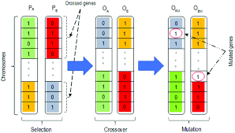

## Genetic Algorithm
Before we start, let's first understand a few concepts in genetic algorithm.

### Concept 1: Genes and Chromosomes
In the genetic algorithm, we first need to map the problem to be solved into a mathematical problem, which is called "mathematical modeling", then a feasible solution to this problem is called a "chromosome". A feasible solution generally consists of multiple elements, then each element is called a "gene" on the chromosome.

For example, for the following function, [1,2,3], [1,3,2], [3,2,1] are all feasible solutions of this function (substitute them into immediately feasible solutions), then These feasible solutions are called chromosomes in genetic algorithm.
> 3x+4y+5z<100

These feasible solutions are composed of three elements, and in the genetic algorithm, each element is called a gene that constitutes a chromosome.

### Concept 2: Fitness function
In nature, there seems to be a God who can select the better individuals in each generation and eliminate some individuals with poor environmental fitness. So in genetic algorithm, how to measure the pros and cons of chromosomes? This is done by the fitness function. The fitness function plays the role of "God" in the genetic algorithm.

The genetic algorithm will perform N iterations during the running process, and each iteration will generate several chromosomes. The fitness function will give a score to all the chromosomes generated in this iteration to judge the fitness of these chromosomes, and then eliminate the chromosomes with lower fitness, and only keep the chromosomes with higher fitness, so that after several iterations The quality of the chromosomes will be better and better.

### Concept 3: CrossOver
Each iteration of the genetic algorithm generates N chromosomes. In the genetic algorithm, each iteration is called an "evolution". So, how did the newly generated chromosomes come from each evolution? - The answer is "crossover", which you can understand as mating.

The process of crossover needs to find two chromosomes from the chromosomes of the previous generation, one is the father and the other is the mother. Then a certain position of the two chromosomes is cut off and spliced ​​together to generate a new chromosome. This new chromosome contains a certain number of father genes and a certain number of mother genes.

So, how do you select the genes of the father and mother from the previous generation of chromosomes? This is not chosen at random and is generally done through a roulette algorithm.

After each evolution is completed, the fitness of each chromosome is calculated, and then the fitness probability of each chromosome is calculated by the following formula. Then during the crossover process, it is necessary to select the parental chromosomes according to this probability. Chromosomes with higher fitness have a higher probability of being selected. This is why genetic algorithms can retain good genes.

> Probability of chromosome i being selected = fitness of chromosome i / sum of fitness of all chromosomes

### Concept 4: Mutation
Crossover can ensure that each evolution leaves good genes, but it only selects the original result set. There are still a few genes, but their combination order is exchanged. This can only ensure that after N times of evolution, the calculation result is closer to the local optimal solution, and can never reach the global optimal solution. In order to solve this problem, we need to introduce mutation.

Variation is well understood. When we generate a new chromosome through crossover, we need to randomly select several genes on the new chromosome, and then randomly modify the value of the genes, thereby introducing new genes to the existing chromosomes, breaking through the current search restrictions, and more It is helpful for the algorithm to find the global optimal solution.

### Concept 5: Replication
In each evolution, in order to retain the excellent chromosomes of the previous generation, the chromosomes with the highest fitness in the previous generation need to be directly copied to the next generation.

Assuming that N chromosomes need to be generated for each evolution, then in each evolution, NM chromosomes need to be generated through crossover, and the remaining M chromosomes are obtained by copying the M chromosomes with the highest fitness in the previous generation.

## Genetic algorithm process
> Through the above concepts, I believe that you have understood the general principles of genetic algorithms. Let us link these concepts together and introduce the execution process of genetic algorithms.

- In the initial stage of the algorithm, it randomly generates a set of feasible solutions, that is, the first generation of chromosomes.

- Then use the fitness function to calculate the degree of fitness of each chromosome separately, and calculate the probability of each chromosome being selected in the next evolution according to the degree of fitness (this has been introduced above, and will not be repeated here).

The above is the preparation process, and the following officially enters the "evolution" process.

- Through "crossover", NM chromosomes are generated;

- Then perform the "mutation" operation on the NM chromosomes generated after crossover;

- Then use the "copy" method to generate M chromosomes;

So far, N chromosomes have been generated! Then, the fitness of N chromosomes and the probability of being selected next time are calculated respectively.

This is an evolutionary process, followed by a new round of evolution.

## How many times does it need to evolve?
Each evolution will be better, so in theory, the more times the evolution, the better, but in practical applications, a balance point is often found between the accuracy of the results and the efficiency of execution. There are generally two ways.

### 1. Limited evolution times
In some practical applications, the number of evolutions can be counted in advance. For example, you have found through a lot of experiments that no matter how the input data changes, the algorithm can get the optimal solution after N times of evolution, then you can set the number of evolutions to N.

However, the actual situation is often not so ideal, and often different inputs will lead to very different iterations when the optimal solution is obtained. This is the second way you can consider.

### 2. Limit the allowed range
If the algorithm wants to reach the global optimal solution, it may have to go through many, many, many times of evolution, which greatly affects the performance of the system. Then we can find a balance between the accuracy of the algorithm and the efficiency of the system. We can set an acceptable range of results in advance. After the algorithm has evolved X times, once it is found that the current result is already within the error range, the algorithm will be terminated.

But this method also has a disadvantage. In some cases, it may enter the error tolerance range after a few evolutions, but in some cases, it needs to evolve many, many, many times to enter the error tolerance range. This uncertainty makes the execution efficiency of the algorithm uncontrollable.

Therefore, which method to choose to control the number of iterations of the algorithm requires you to choose reasonably according to the specific business scenario. There is no universal way here, you need to find the answer yourself in real practice.

### Chromosomes
From the above we know that each evolution will produce N chromosomes, each chromosome is a feasible solution to the current problem, and the feasible solution is composed of multiple elements, each element is called a gene of the chromosome. Next, we use a chromosome matrix to record the feasible solutions in each evolution of the algorithm.

A chromosome is made up of:
> chromosome={1,2,3,4}

A chromosome is a one-digit array, the subscript of the one-digit array represents the number of the task, and the value of the array represents the number of the node. Then the meaning of chromosome[i]=j is: assign task i to node j.

In the above example, the task set is Tasks={2,4,6,8}, and the node set is Nodes={2,1}, then the meaning of chromosome chromosome={3,2,1,0} is:
- Assign task 0 to node 3
- Assign task 1 to node 2
- Assign task 2 to node 1
- Assign task 3 to node 0

### Fitness matrix
It can be seen from the above that the fitness function plays the role of "God" in the genetic algorithm. It will judge the fitness of each chromosome, retain chromosomes with high fitness, and eliminate chromosomes with poor fitness. Then when the algorithm is implemented, we need a fitness matrix to record the fitness of the current N chromosomes, as shown below:
> adaptability={0.6, 2, 3.2, 1.8}

The subscript of the adaptability array represents the chromosome number, and adaptability[i] represents the fitness of the chromosome number i.

In the example of load balancing scheduling, we take the total execution time of N tasks as the criterion for fitness evaluation. When all tasks are assigned, if the total duration is longer, the fitness will be worse; and the shorter the total duration, the higher the fitness.

### select probability matrix
It can be seen from the above that in each evolution process, it is necessary to calculate the probability of each chromosome being selected in the next evolution according to the fitness matrix. This matrix is ​​as follows:
> selectionProbability={0.1, 0.4, 0.2, 0.3}

The subscript of the matrix represents the number of the chromosome, and the value in the matrix represents the corresponding selection probability for that chromosome. Its calculation formula is as follows:
> selectionProbability[i] = adaptability[i] / sum of fitness
